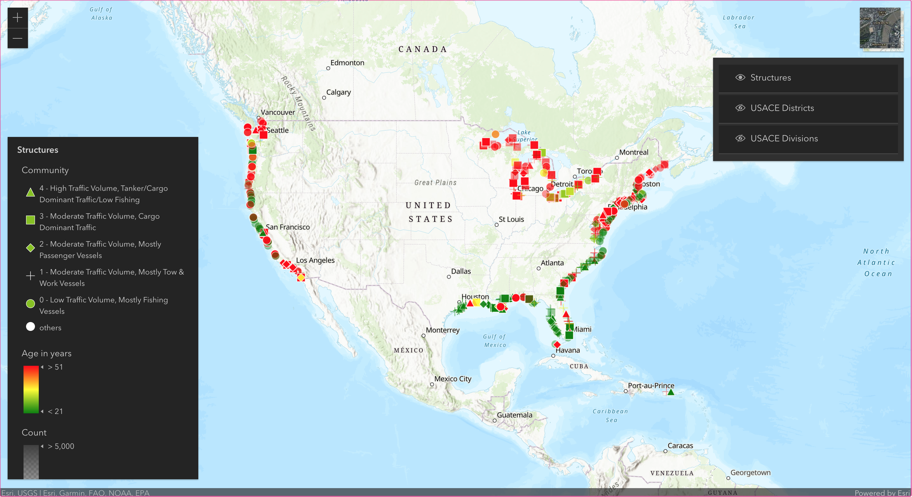
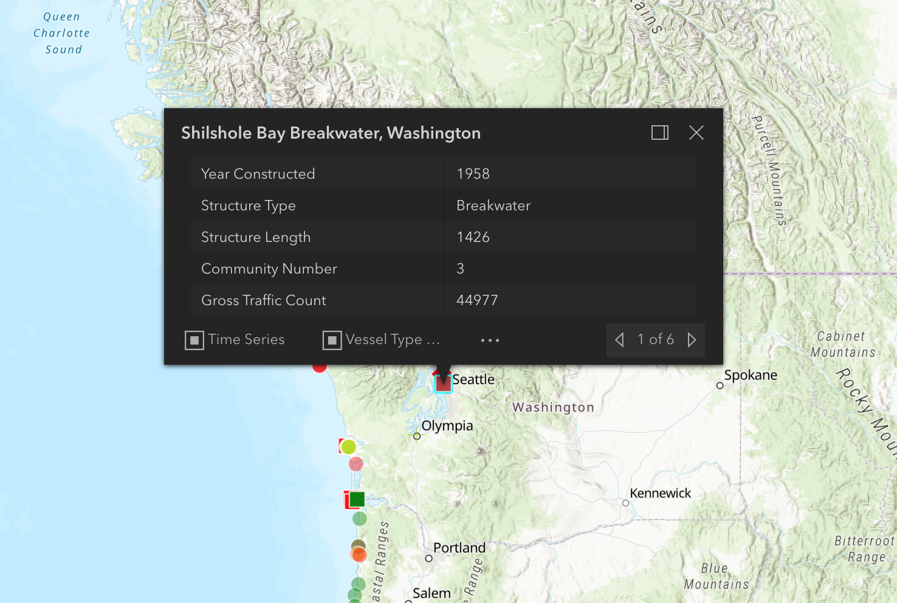
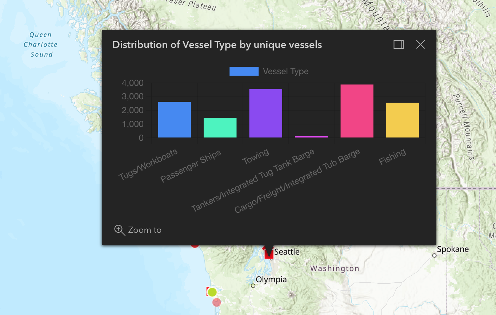
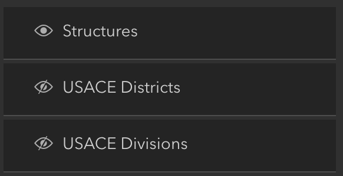
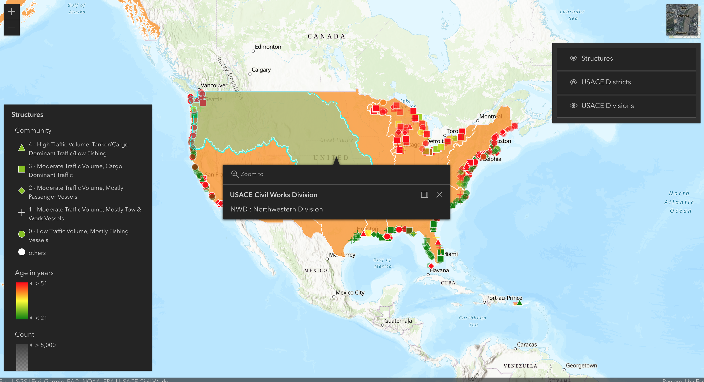

# Visualizing Vessel Traffic Near Costal Structures

## Purpose

This project was created for the USACE to help understand data about vessel traffic near coastal structures across the US. This project is currently hosted on Google Cloud Services at the following link https://strange-tome-305601.ue.r.appspot.com/

---

## Overview

When loaded the project will display the default map with the **Structures** layer turned on. Each point on the map represents a unique costal structure.

The basemap may also be toggled to a satellite view.

### Structure Information

Clicking on a point will show a panel containing basic information about that structure.

From this panel different graphs showing distributions about vessel traffic can be viewed.

There is also a legend displaying what each characteristic of a point on the map signifies.

### Other Layers

There are two additional layers that may be toggled on and off using the layer toggler. The **District Layer** and the **Division Layer**

---

## Technologies

This project was built using Go for the backend and ReactJs for the frontend. Google Cloud Services is also used to host the project on the cloud.
